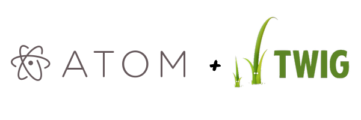

# Bringin Twig to Atom

Twig syntax highlighting for atom.

This package is a fork with some update of the [php-twig](https://github.com/reesef/php-twig) package which seemed to be abandoned.

Languages supported :
* HTML
* CSS
* Javascript
* JSON
* XML

Originally forked from https://github.com/reesef/php-twig

Originally converted from https://github.com/Anomareh/PHP-Twig.tmbundle
